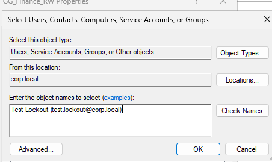
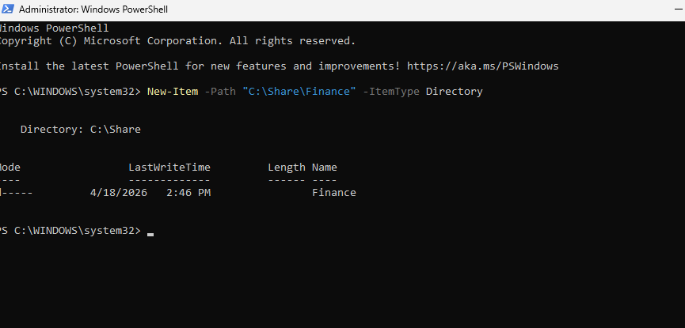
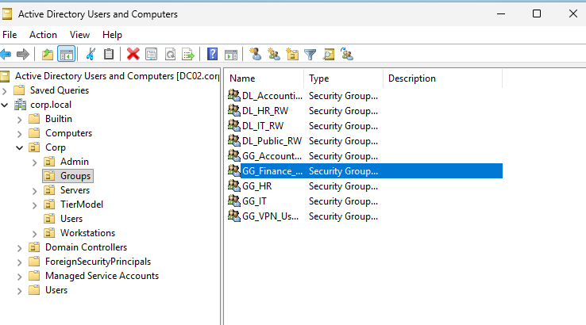
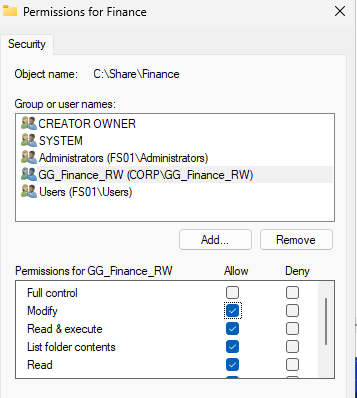
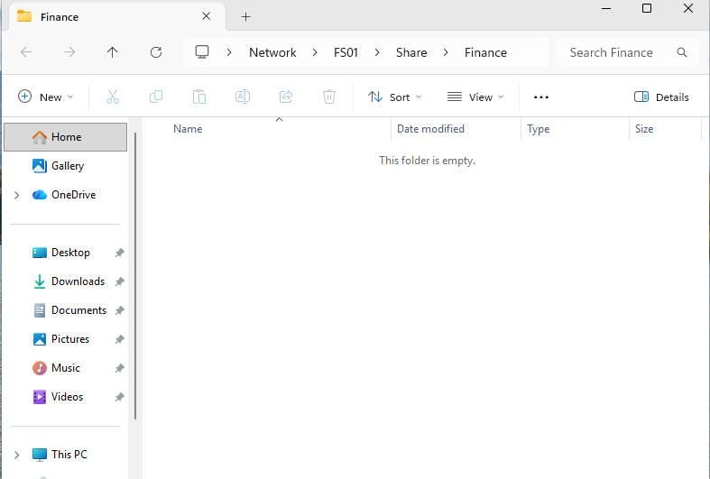
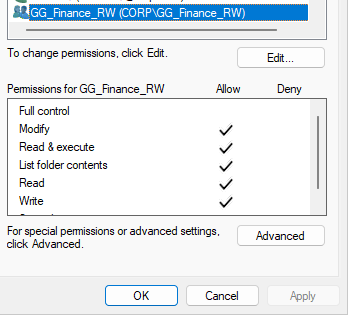
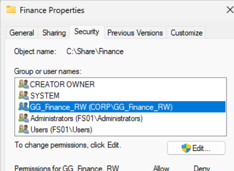
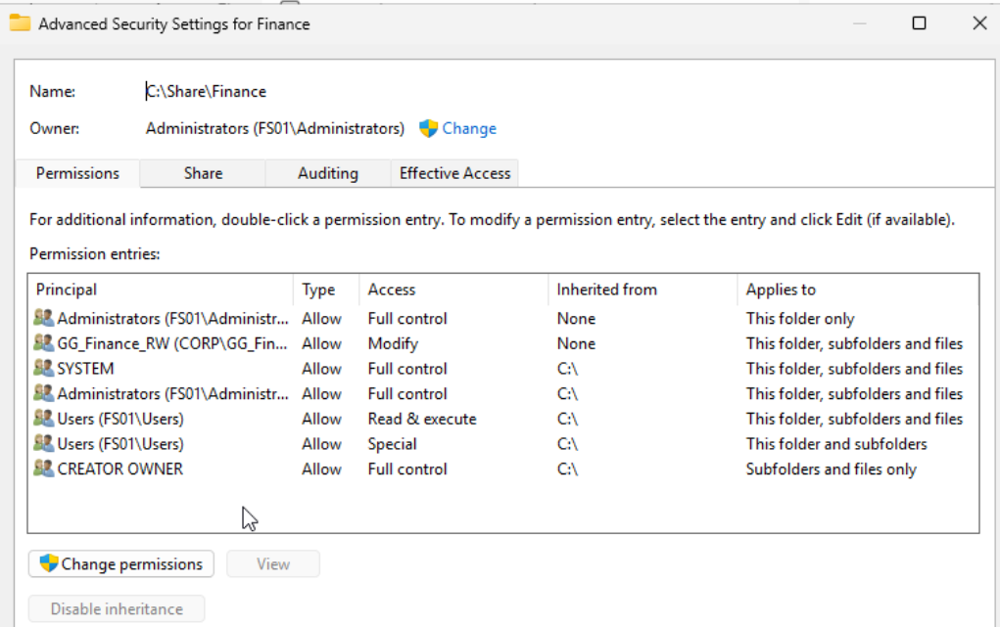
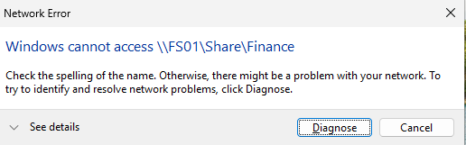
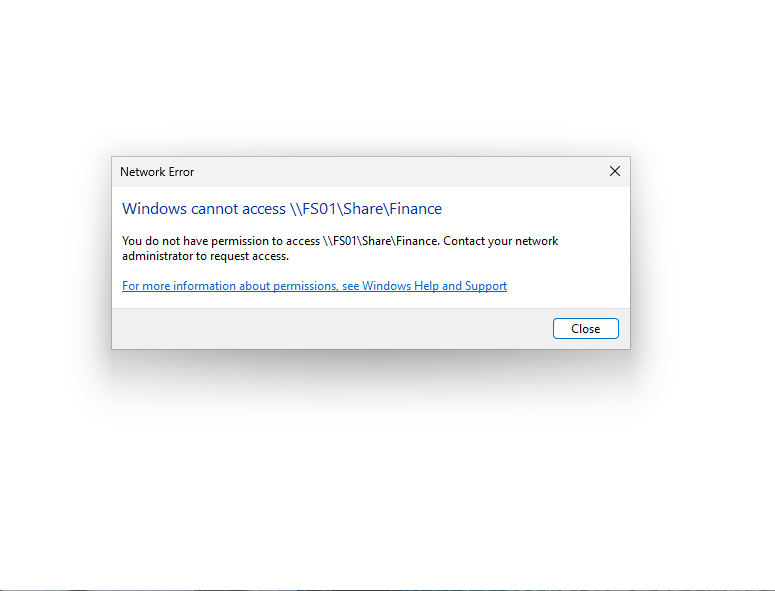

# Access Denied - NTFS Permissions and Group-Based Access Lab

## Lab Steps

### 1. Created Finance Folder

### 2. Created Security Group

### 3. Added User to Group

### 4. Assigned NTFS Permissions

### 5. Verified Initial Access

### 6. Investigated Unexpected Access

### 7. Reviewed Advanced Permissions

### 8. Observed Access Error

### 9. Final Access Denied

