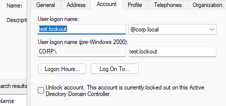
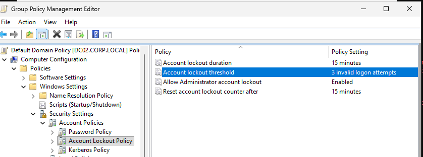
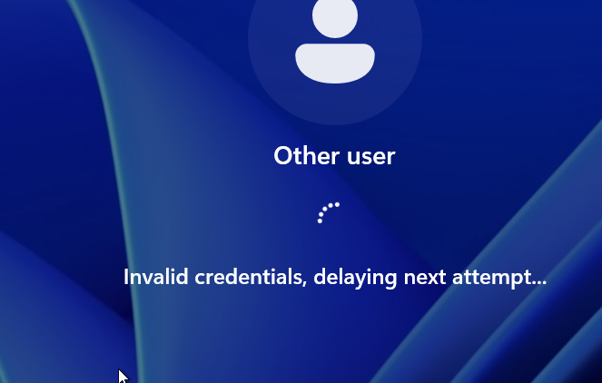
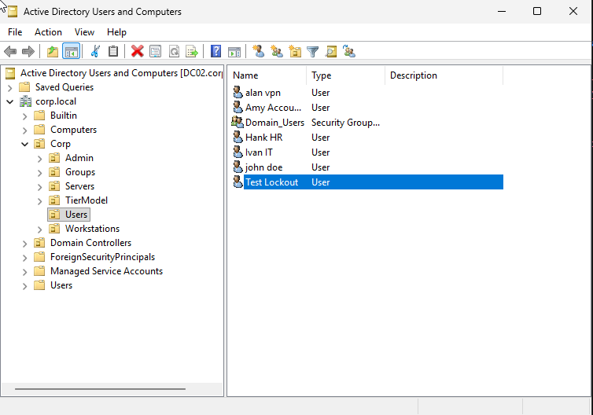
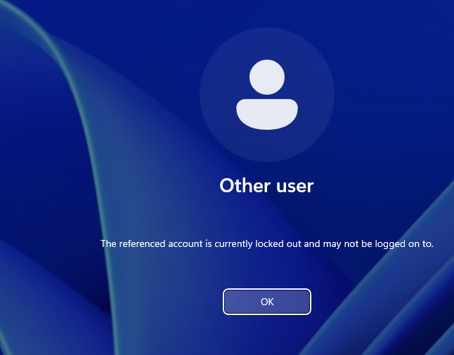

# Account Lockout Investigation Lab

## Objective
Simulate a common help desk issue where a user account becomes locked out, investigate the lockout in Active Directory, identify the source system responsible for the failed logon attempts, and restore access.

## Scenario
A user reports that they cannot sign in. Instead of immediately resetting the password, the goal is to verify whether the account is actually locked out, determine where the failed attempts originated, and then resolve the issue.

## Skills Practiced
- Active Directory user management
- Group Policy account lockout configuration
- Windows logon troubleshooting
- Event Viewer investigation
- Identifying the source of failed authentication attempts
- Restoring user access safely

## Environment
- **Domain:** `corp.local`
- **Domain Controller used for investigation:** `DC02.corp.local`
- **Client system generating failed logons:** `CL01`
- **Test account:** `CORP\test.lockout`

## Tools Used
- Active Directory Users and Computers (`dsa.msc`)
- Group Policy Management (`gpmc.msc`)
- Event Viewer (`eventvwr.msc`)

## Lab Steps

### 1. Created a test user in Active Directory
A dedicated test user was created so the lockout could be reproduced safely without affecting production-style admin or user accounts.

### 2. Configured account lockout policy in Group Policy
The domain account lockout policy was configured to lock an account after **3 invalid logon attempts**.

**Configured settings:**
- Account lockout threshold: **3 invalid logon attempts**
- Account lockout duration: **15 minutes**
- Reset account lockout counter after: **15 minutes**

### 3. Triggered failed sign-in attempts from the client system
Incorrect credentials were entered on the client system to generate repeated authentication failures.

This also showed the Windows sign-in throttling behavior:

### 4. Confirmed the account lockout at the sign-in screen
After the invalid attempts reached the configured threshold, Windows reported that the account was locked out.

### 5. Verified the account was locked in Active Directory
The user account properties in ADUC showed that the account was currently locked out on the Active Directory domain controller.

### 6. Investigated the lockout event in Event Viewer
On the domain controller, Event Viewer was used to review **Security log Event ID 4740**.

Key findings from the event:
- **Locked account:** `test.lockout`
- **Caller Computer Name:** `CL01`
- **Computer recording the event:** `DC02.corp.local`

This confirmed that the lockout was caused by failed authentication attempts originating from **CL01**.

### 7. Unlocked the account and confirmed successful access
After the investigation, the account was unlocked in Active Directory and a successful sign-in was confirmed.

.png)

## Findings
- The lockout was successfully reproduced using a controlled test account.
- The domain lockout policy worked as configured after 3 bad password attempts.
- Event ID **4740** is critical for identifying where a lockout originated.
- The **Caller Computer Name** field is especially valuable in real help desk environments because it can point to:
  - an end-user workstation
  - a stale mapped drive
  - a saved password in Outlook or another application
  - a scheduled task or service using old credentials
  - a mobile device repeatedly attempting authentication

## Why This Matters
This is a common help desk issue, but it also builds foundational IAM and AD troubleshooting skills. A technician who only unlocks the account fixes the symptom. A technician who checks the event logs and identifies the source system is working toward root cause analysis.

## Interview Version
> I built a lab to simulate an Active Directory account lockout, configured the domain lockout policy, triggered failed sign-in attempts from a client device, and investigated Event ID 4740 in Event Viewer. I was able to identify the source workstation causing the lockout and then restore access by unlocking the account.

## Key Takeaway
This lab reinforced the difference between simply resolving a user issue and actually understanding the authentication path, policy enforcement, and evidence available in Windows security logs.
